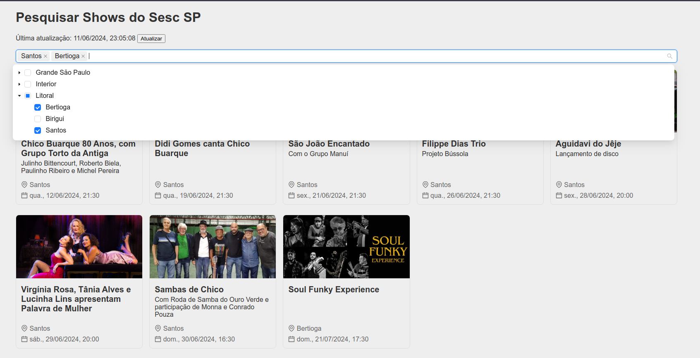

# Sesc Concerts SP

Site para procurar shows realizados pelo [Sesc SP](https://www.sescsp.org.br/)

## Por quê?

Utilizando o site oficial do sesc encontrei 3 principais problemas

1. **Não é possível buscar por mais de uma unidade**, por exemplo "todas da capital", apenas 1 unidade por vez ou todas juntas (o que pode incluir unidades muito distantes)
2. **Poucos itens aparecem por vez na lista**, sendo necessário clicar em "Ver mais" frequentemente e, ao clicar, apenas 3 novos itens aparecem por vez
3. **Os links abrem na mesma janela**, o que geralmente não é um problema, mas ao abrir uma atividade e voltar para a lista a rolagem é resetada, sendo necessário rolar a página e clicar em "Ver mais" até chegar ao ponto anterior

Pensando nisso, implementei as seguintes soluções:

1. **Busca por unidade com multi-select**, com agrupamento por categoria (Capital, Interior e Litoral), assim é possível selecionar suas unidades preferidas e até grupos inteiros, ex: Todas da capital + Santos
2. **Melhor aproveitamento da tela**, mostrando até 5 itens por linha (dependendo da resolução da tela) e todos os itens carregados de uma vez, sem a necessidade de clicks adicionais
3. **Os links sempre abrem em nova janela**, assim você não perde o ponto onde estava, nem mesmo por um toque acidental

## Evoluções Futuras

- [ ]  Salvar filtro de unidade no local storage
- [ ]  Filtrar por data específica ou range
- [ ]  Filtrar outras categorias (curso, bate-papo, concerto, por exemplo). Atualmente apenas atividades da categoria "show" são exibidos
- [ ]  Filtrar por busca de texto
- [ ]  Mostrar badge de “novo” para shows que o usuário ainda não viu

    Salvar os show vistos (mostrados na tela) no local storage. Ao listar os shows, se o show não estiver no localStorage, marca como novo

- [ ]  “Termos em destaque”
    - [ ]  O usuário pode salvar termos para serem destacados (nomes de artista, por exemplo)
        - [ ]  Salvar termos no localStorage
    - [ ]  Atividades que contenham 1 ou mais termos salvos são mostrados com destaque
        - [ ]  Seção especial no começo da página
        - [ ]  Badge na listagem geral
- [ ]  Adicionar a serviço de agenda (Google Calendar pelo menos)
- [ ]  Visão de calendário
